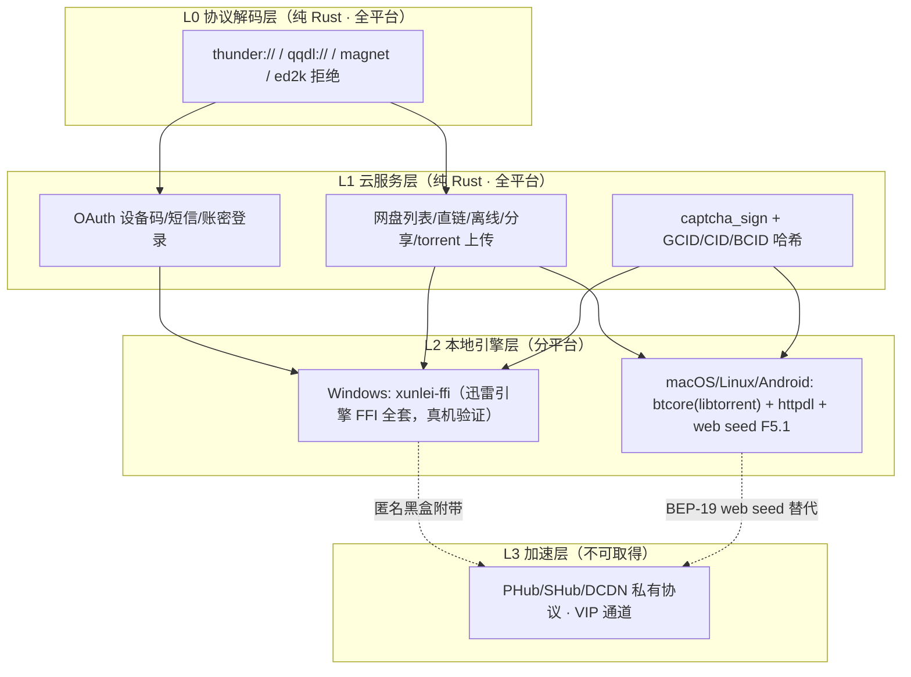

# 迅雷跨平台通解研究 —— 「通解能否成立」与「下载能力能否完全取下」的权威解答

> 任务：Phase 2 · Task 5-c。回答用户 Q2 原话：**「迅雷跨平台的能做到通解吗？整个迅雷的下载能力能完全的取下来了吗？」**
> 日期：2026-08-30。性质：纯研究文档（不写代码），作为给用户的正式回答材料。
> 证据基线：仓库内逆向文档、真机验证脚本、已合入代码。所有结论均给出来源（文件路径 + 关键行/结论），不确定处标注「**待验证**」。
> 路径约定：下文相对路径均以仓库根 `/home/z/my-project/repo-smart-downloader/` 为基准。

---

## 0. 结论速览（TL;DR）

### 0.1 问题一：迅雷跨平台能做到通解吗？—— **能，且已成立**，但"通解"必须分层理解

| 层 | 名称 | 通解形态 | 平台覆盖 | 判定 |
|---|------|---------|---------|------|
| **L0** | 协议解码层 | 纯 Rust（`crates/core/src/source_parse/`），无平台依赖 | Windows / macOS / Linux（+Android NDK 交叉，待验证） | ✅ 全平台一致 |
| **L1** | 云服务层 | 纯 Rust HTTP（`crates/provider/src/xunlei/`，reqwest + 三要素头） | 同上 | ✅ 全平台一致（**跨平台通解的核心**） |
| **L2** | 本地引擎层（真实数据传输：P2SP/BT） | Windows = 迅雷引擎 FFI 黑盒；其余平台 = libtorrent 纯 Rust 栈（btcore）+ 云直链兜底 | 分平台，但能力等效补齐 | ✅（等效通解） |
| **L3** | 加速层（VIP 加速通道、PHub/SHub/FreeDCDN 私有 P2P 协议自研） | 无通解 | 无 | ❌ 不可取得（协议未公开 + D28 决策） |

一句话：**L0/L1 是"一套代码跑遍全平台"的真通解（已实现并验证）；L2 是"分平台实现、统一抽象"的等效通解（Windows 已完整、其余平台有成熟替代）；L3 永远不通解。**

### 0.2 问题二：整个迅雷的下载能力能完全取下来了吗？—— **不能 100%，但能取下"对用户有效"的绝大部分，且缺口全部可解释、可补偿**

| 能力域 | 取得程度 | 说明 |
|--------|---------|------|
| 协议/链接解码（L0） | **≈100%** | thunder:// qqdl:// magnet 全实现；ed2k 为决策性拒绝；fs2you:// 未实现（低成本扩展点） |
| 云服务（L1） | **≈95%** | 登录三路（设备码✅/短信✅/账密🔶）、网盘列表/直链/分享/离线/torrent 上传全取下；仅剩 3 个 B 级端点未实测（云搜索、multipart 直传、在线解压路由） |
| 本地引擎（L2） | **Windows 100%**；macOS 静态还原约 60%（绑定未接线）；Android 仅侦察 | 非 Windows 平台由 libtorrent + httpdl + 云直链**等效替代**，用户可完成同样的下载任务，但不含迅雷私有 swarm 的速度加成 |
| 私有加速（L3） | **0%** | 技术上不可行 + D28 决策排除（见 §2.3） |

**最终一句话**：「迅雷的下载能力」= ① 可公开取得的部分（协议解码 + 云 API）+ ② 平台绑定的部分（引擎二进制 FFI）+ ③ 服务端授权的私有加速。①已全平台通解，②Windows 已完整、其余平台有标准栈等效替代，③按 D28 决策永久排除——这是能力边界的天花板，不是工程欠账。

---

## 1. 分层通解架构

### 1.1 架构图



ASCII 等效（三平台同一 daemon 入口，引擎层分派）：

```
用户链接 → smart-dl daemon（crates/daemon）
   │
   ├─ L0 source_parse::normalize   ←—— 纯 Rust，全平台同一份代码
   ├─ L1 provider::xunlei          ←—— 纯 Rust HTTP，全平台同一份代码
   │
   └─ L2 DownloadEngine trait（crates/core/src/types.rs）
        ├─ Windows：XunleiEngine（xunlei-ffi → DownloadSDKProxy.dll）
        └─ 非 Windows：BtEngine(btcore/libtorrent) + HttpEngine(httpdl)
              └─ 慢/冷种时 → M6 云兜底（POST /tasks/:id/fallback → L1 直链 → httpdl）
   L3 私有加速：除 Windows FFI 黑盒匿名 FreeDCDN 外，无任何取得路径
```

### 1.2 L0 协议解码层能力表（纯 Rust，零平台差异）

| 能力项 | Windows | macOS | Linux | 实现载体 | 证据 |
|--------|:---:|:---:|:---:|---------|------|
| thunder:// 解码 | ✅ | ✅ | ✅ | `crates/core/src/source_parse/normalize.rs:43-50`（`base64("AA"+URL+"ZZ")`，§7.1 D36） | 单测 `normalize.rs:103-127` |
| qqdl:// 解码 | ✅ | ✅ | ✅ | `normalize.rs:52-63`（无壳 base64） | 单测 `normalize.rs:129-146` |
| magnet 分类透传 | ✅ | ✅ | ✅ | `normalize.rs:65-67` + info-hash 提取 `crates/provider/src/xunlei/client.rs:51-78` | `PROJECT_STATUS.md:19` |
| ed2k 处理 | ❌（一致拒绝） | ❌ | ❌ | `normalize.rs:68-69` 路由拒绝；完整 eMule 协议归远期专项（`docs/BACKLOG.md` C 段） | 决策性排除，非技术缺口 |
| fs2you:// 解码 | ❌ | ❌ | ❌ | 全仓 grep 0 命中——**未实现**（纯解码层扩展点，成本≈半天，**待实现**） | 本文新标注 |
| panic/回车单测覆盖 | ✅ | ✅ | ✅ | 解码失败归一为 `Unsupported`，不 panic | `normalize.rs:103-150` |

### 1.3 L1 云服务层能力表（纯 Rust reqwest，零平台差异）

| 能力项 | Windows | macOS | Linux | 实现载体 | 证据 |
|--------|:---:|:---:|:---:|---------|------|
| OAuth 设备码扫码登录（QR + 轮询） | ✅ | ✅ | ✅ | `client.rs:372-421`（request_device_code/poll_device_token）+ `device.rs:7-113`（DeviceAuthFlow 状态机） | 端到端真机验证 8/22+8/25（`PROJECT_STATUS.md:99-101`） |
| 短信登录 | ✅ | ✅ | ✅ | `client.rs:492`（send_sms_code）/ `client.rs:588`（verify_sms_code）；`xllite_reverse.md:36`：流程已验证至 verify 步 | 活体端到端收尾**待验证**（需新鲜验证码） |
| 账密登录 | 🔶 | 🔶 | 🔶 | `client.rs:228-334`（signin，带全量 captcha meta 套件） | 代码完备但被服务端滑块风控 `result:review` 阻塞（`xllite_reverse.md:37`）；服务端风控与客户端平台无关 |
| token 自动刷新（12h 续期） | ✅ | ✅ | ✅ | `client.rs:201`（refresh）+ `auth.rs`（AuthState load/save + JWT 解析） | `PROJECT_STATUS.md:101` |
| captcha/init 全 meta 套件 | ✅ | ✅ | ✅ | `client.rs:234-285` + `sign.rs`（captcha_sign/device_id_32/device_sign，移植自 alist MIT + xunlei-lixian） | `PROJECT_STATUS.md:102`；极简 meta 被风控打回实测（`client.rs:234-236`） |
| 网盘文件列表（三件套头） | ✅ | ✅ | ✅ | `client.rs:438`（list_files；Bearer + x-client-id + x-device-id + x-captcha-token） | 同源验证通过（`PROJECT_STATUS.md:103`） |
| 下载直链提取（PLAY→web_content_link） | ✅ | ✅ | ✅ | `client.rs:424`（resolve_link） | F3 PoC：26MB 全量 MD5 与云端逐字节一致（`BACKLOG.md:14-16`）；无私有流/加密假设被证伪 |
| 分享链接解析（/s/xxx?pwd=） | 🔶 | 🔶 | 🔶 | `share.rs:1-6`（parse_share_link 纯函数充分单测） | 纯函数✅；**匿名取链网络链路实测无法完整跑通**（`share.rs:3-5` 模块级结论）——登录态分享取链**待验证** |
| 离线任务提交/轮询 | ✅ | ✅ | ✅ | `client.rs:788`（offline_submit，POST /drive/v1/files UPLOAD_TYPE_URL）/ `client.rs:829`（offline_tasks） | 端点格式实测（`client.rs:787` 注释：verify_offline_submit.py 实测通过） |
| 离线配额档位 + 烧尽事件 | ✅ | ✅ | ✅ | 数据面（free=3 / ordinary=100 / platinum=100 / super=500 / super.year=1000；error_code 11） | `BACKLOG.md:27`（实测响应 JSON，2026-08-25） |
| .torrent 字节上传（离线） | ✅ | ✅ | ✅ | `client.rs:882-897`（解析 info-hash → magnet → 走已验证 URL 通道）；multipart 直传为 B 级可选未实测（`client.rs:899-909`） | 证据分级注释 `client.rs:862-879` |
| 云盘搜索 | 🔶 | 🔶 | 🔶 | `cloud_search.rs:1-17`（xlppc.searcher.api 双端点骨架） | B 级待验（disk cache 取证，鉴权头未取证） |
| 直链分类器 + CDN host 表 | ✅ | ✅ | ✅ | `url_class.rs:1-49`（A=迅雷自有 CDN / B=普通源；PHub/SHub host 表 + 202 条 CDN host） | 移植自 toolkit 实测脚本（`url_class.rs:4-8`） |
| GCID/CID/BCID 哈希（秒传算法地基） | ✅ | ✅ | ✅ | `hash.rs`（`mod.rs:15` 导出 bcid/cid/gcid） | 算法公开（`FINAL_REPORT.md:53-72`：xlgcid-python + binux 博客交叉印证） |
| 云兜底调度（M6） | ✅ | ✅ | ✅ | `POST /tasks/:id/fallback`：BT 暂停且 <50% → provider 直链 → HttpEngine；provider 失败冷却 Auth 5min/Quota 1h/其他 1min | `BACKLOG.md:36-37`（2026-08-27 完成） |

### 1.4 L2 本地引擎层能力表（分平台，DownloadEngine trait 统一抽象）

| 能力项 | Windows | macOS | Linux | 实现载体 | 证据 |
|--------|:---:|:---:|:---:|---------|------|
| 磁力任务创建 | ✅ 迅雷引擎 | 🔶 未接线 | ✅ libtorrent | Win：`xunlei-ffi/src/task.rs:26-66`（XL_CreateMagnetTask，3 参 UTF-16 反汇编铁证）；其余：btcore magnet | `PROJECT_STATUS.md:55`；`task.rs:24-25` |
| BT 任务创建 | ✅ 迅雷引擎 | 🔶 未接线 | ✅ libtorrent | Win：`task.rs:76-129`（XL_CreateBTTask_V2，param.size=0x28 铁证，third_str 必须非空 `task.rs:99-101`） | `PROJECT_STATUS.md:55` |
| P2SP/HTTP 任务 | ✅ 迅雷引擎 | 🔶 未接线 | ✅ httpdl 动态分段 | Win：`task.rs:137-180`（XL_CreateP2spTask 6 参薄包装，真机验证 task_id=1）；其余：httpdl SegmentManager（commit `109692c`，`BACKLOG.md:43`） | `task.rs:133-136` |
| 启动/停止/删除 | ✅ | 🔶 | ✅ | Win：`task.rs:183-229`（XL_StartTask/XL_StopTask/XL_DeleteTask）；macOS 符号已定位未绑定（`macos_abi_reverse.md:87-90`） | — |
| 进度/状态查询 | ✅ | 🔶 卡点 | ✅ | Win：`query.rs:14-19`（TaskState 0/3/5/7 真机 dump 铁证）+ `query.rs:66`（XLTaskInfo=0x39c=924 字节）；macOS 卡 `TAG_XL_TASK_INFO_EX`（`PROJECT_STATUS.md:74`） | `query.rs:12-19` |
| 速度查询 | 🔶 | 🔶 | ✅ | Win：XL_QueryTaskFlow 3 参签名待补（`PROJECT_STATUS.md:62`）；macOS：`XLGetGlobalDownloadSpeed` 签名已还原（`macos_abi_reverse.md:111-119`）但绑定未开始；其余：libtorrent 原生 | — |
| Peer 注入/封禁 | ✅ | ❌ | ✅ libtorrent add_peer | Win：`peer.rs:18-50`（XL_AddPeer/XL_BatchAddPeer） | — |
| Tracker 批量注入 | ✅ | ❌ | ✅ libtorrent add_tracker | Win：`tracker.rs`（XL_BatchAddBTTracker） | — |
| FreeDCDN 匿名加速 | ✅ 黑盒开关 | ❌ | ❌ | Win：`dcdn.rs:13-29`（XL_EnableFreeDcdn，UserID=0 免登录，`lib.rs:5` 文档铁证）；替代：BEP-19 web seed（F5.1） | `dcdn.rs:1-3` |
| 身份注入（token/GUID/加速证书） | ✅ | 🔶 | ❌ | Win：`identity.rs:25-80`（A 级三件套）；B 级四函数未封装（`identity.rs:14-15`） | `sdk_export_inventory.md:36-44` |
| fastresume（迅雷任务迁移） | ✅ | ✅ | ✅ | `daemon/src/cli.rs:39-40,127-167`（import-xunlei：xlbt.cfg + .bt.xltd + .torrent → fastresume）+ e2e 测试 `crates/daemon/tests/xunlei_import_api.rs`（`BACKLOG.md:40`） | 真实样本验证：piece SHA1 命中 99.1%（`RESEARCH_STATE.md:15-29`） |
| web seed 混合加速（F5.1） | ✅ | ✅ | ✅ | `POST /tasks/:id/webseeds` → `BtEngine::add_url_seed` → FFI `lt_add_url_seed` 全链 | `BACKLOG.md:21`（2026-08-25 完成；直链时效 ≈1h 需换链、UA 需含 Thunder） |

> 注：Android 列略——L2 三项核心（磁力/BT/查询）在 Android 侧均处"侦察完成、绑定未开始"（见 §2.2），运行时形态与 Linux 列一致（纯 Rust 栈，需 NDK 交叉编译，**待验证**）。

### 1.5 L3 加速层能力表（不可取得层）

| 能力项 | Windows | macOS | Linux | 判定依据 |
|--------|:---:|:---:|:---:|---------|
| PHub/SHub/DPHub 私有 P2P 协议自研 | ❌ | ❌ | ❌ | RSA-1024 包裹每请求随机 AES key，离线密钥派生不可能（`p2p_research_complete.md:10-28` v3 勘误）；PAM 2012：300+ 命令字、中心服务器必需 |
| DCDN/FreeDCDN 协议自研（不依赖 DLL） | ❌ | ❌ | ❌ | D28 原文：DCDN 接入协议未公开（`BACKLOG.md:56`） |
| uDT 私有传输层 | ❌ | ❌ | ❌ | 56 类自研 uTP-like（CUBIC/多路复用/NAT 检测），无公开规格（`xunlei_independence_analysis.md:417-441`） |
| VIP 加速通道（TrySpeed/SuperSpeed/组队） | ❌ | ❌ | ❌ | 服务端配额发放（trial_left_times）+ VipSpeedUpUrl 路径未明 + 证书下发流程未知，三缺口需 Frida 活体抓包（`SPEEDUP_SYSTEM.md:46-53`） |
| 快鸟宽带提速 | ❌ | ❌ | ❌ | 与下载能力无关且地域绑定（北京电信实测 ret:11 err:1101，`SPEEDUP_SYSTEM.md:9`） |
| （注记）免登录 FreeDCDN 经 Windows DLL 黑盒 | ✅ | ❌ | ❌ | 这不是 L3 协议自研，而是 L2 FFI 的附带行为（`dcdn.rs`）；无 DLL 的平台无任何等价物 |

---

## 2. 能力抽取矩阵（回答「完全取下来了吗」）

### 2.1 ✅ 已完全取得（24 项，均有代码/脚本/实测背书）

| # | 能力 | 证据（代码路径 / 文档） |
|---|------|------------------------|
| 1 | thunder:// 解码 | `crates/core/src/source_parse/normalize.rs:43-50` + 单测 |
| 2 | qqdl:// 解码 | `normalize.rs:52-63` + 单测 |
| 3 | magnet 透传 + info-hash 提取 | `normalize.rs:65-67`；`client.rs:51-78`（bencode_info_hash） |
| 4 | 设备码 QR 登录（端到端） | `client.rs:372-421` + `device.rs`；真机 8/22+8/25 双验（`PROJECT_STATUS.md:99-101`） |
| 5 | 短信登录（send/verify） | `client.rs:492,588`；`xllite_reverse.md:36`（验证至 verify 步；端到端活体**待验证**） |
| 6 | captcha_sign / device_sign / device_id_32 | `sign.rs`（`mod.rs:17`）；`PROJECT_STATUS.md:102` |
| 7 | 网盘文件列表（三件套头） | `client.rs:438`；`PROJECT_STATUS.md:103` |
| 8 | 下载直链提取（原始直链，无私有流） | `client.rs:424`；F3 PoC 26MB MD5 逐字节一致（`BACKLOG.md:14-16`） |
| 9 | 直链多线程 Range 并行 | F3：8 线程 823KB/s（`BACKLOG.md:14`） |
| 10 | 分享链接解析（纯函数层） | `share.rs:17-44`（SharedLink/SharedFile/ResolvedLink 结构 + parse_share_link） |
| 11 | 离线任务提交（magnet/URL） | `client.rs:788-826`（verify_offline_submit.py 实测） |
| 12 | 离线任务列表轮询 | `client.rs:829-859` |
| 13 | 离线配额档位表 + error_code 11 降级 | `BACKLOG.md:27` |
| 14 | .torrent 上传离线（info-hash 通道） | `client.rs:882-897` |
| 15 | GCID/CID/BCID 哈希算法 | `hash.rs`；`FINAL_REPORT.md:53-72`（算法公开 A 级） |
| 16 | OAuth token 刷新 + 凭证本地持久化 | `client.rs:201`；`auth.rs`；凭证仅本地约定（`PROJECT_STATUS.md:124-127`） |
| 17 | Windows 引擎 FFI 全套（loader/bindings/lifecycle/task/query/peer/tracker/dcdn/identity） | `crates/xunlei-ffi/src/` 全模块；`PROJECT_STATUS.md:47-59` |
| 18 | Windows 真机验证（P2SP 完整生命周期 + BT 下载） | `scripts/research/xunlei/verify_p2sp_lifecycle.py` / `verify_bt_download.py`（`PROJECT_STATUS.md:59`） |
| 19 | Windows 匿名 FreeDCDN 开关 | `dcdn.rs:13-48`（UserID=0 免登录） |
| 20 | 身份注入三件套（SetTokenMode/SetAppGuid/SetAccelerateCertification，A 级） | `identity.rs:25-80`；`sdk_export_inventory.md:36-44` |
| 21 | fastresume 迁移（迅雷 → libtorrent） | `daemon/src/cli.rs:39-40,127-167`；真实样本验证（`RESEARCH_STATE.md:15-29`：cfg magic 实为 "XDLCTX\x00\x00"，TLV 结构，piece SHA1 命中 99.1%）；e2e API 测试（`BACKLOG.md:40`） |
| 22 | web seed 混合加速（BT + 迅雷 CDN 直链叠加） | F5 PoC 100+155=255KB/s（`BACKLOG.md:20`）+ F5.1 Rust 实装（`BACKLOG.md:21`） |
| 23 | 云兜底 fallback + provider 失败冷却 | `BACKLOG.md:36-37`（M6，2026-08-27） |
| 24 | 直链分类器 + 202 条 CDN host 表 | `url_class.rs:1-49` |

### 2.2 🔶 部分取得（11 项，含卡点与解除路径）

| # | 能力 | 已取得部分 | 具体缺失 | 解除路径 |
|---|------|-----------|---------|---------|
| 1 | **macOS DownloadKit 引擎绑定** | 二进制提取（fat + arm64 11.26MB，94892 符号）、14 个关键 C 导出地址、`TAG_TASK_PARAM_BT` 核心字段、`XLInitParam` 完整 148 字节布局（9 组 (ptr,len) + f64 + flags）、101 个 mangled 函数签名、Start/Stop/Release/Create*/GetTaskInfo/GetGlobalDownloadSpeed 签名 | ① `TAG_XL_TASK_INFO_EX` 输出布局（虚函数表多级调度，静态分析未突破，`macos_abi_reverse.md:245-249`）；② XLInitParam 9 组 (ptr,len) 语义；③ 完整 153 导出映射（现约 30）；④ `crates/xunlei-ffi-macos/` 未创建（`PROJECT_STATUS.md:76`） | §4.1 路线图：30 行 C 测试程序 hex dump（最快 ground truth）→ Ghidra 符号恢复 → 止损判定 |
| 2 | **Android 引擎绑定** | `libxl_thunder_sdk.so`（8.96MB arm64）提取；159 个 XL 函数从字符串还原（比 Windows 100 个更全，含 XLGetGlobalDownloadSpeed/XLInsertDHTNode）；JNI 边界确认 | 符号表完全剥离（无 SYMTAB/STRTAB/GNU_HASH，`android_sdk_scout.md:18-22`），不可 dlopen；JNI 注册表未逆向；ARM64 反汇编为新工作 | §4.2 路线图：建议止损，云层 + 纯 Rust 栈覆盖（侦察报告原判断，`android_sdk_scout.md:74`） |
| 3 | 账密登录 | signin 全代码链（captcha/init 全 meta → POST /v1/auth/signin，`client.rs:228-334`） | 服务端滑块风控 `result:review`（`xllite_reverse.md:37`） | xl_al 指纹移植或以设备码/短信为主路径 |
| 4 | 分享匿名取链 | 纯函数解析 + 端点形状 | 网络链路实测无法完整跑通（`share.rs:3-5`） | 登录态分享取链实测（**待验证**） |
| 5 | 云盘搜索 | 双端点形状还原 | 鉴权头未取证（B 级待验，`cloud_search.rs:9-14`） | 真实抓包 |
| 6 | Windows 速度查询 | XL_QueryTaskInfo 进度/peer 数 | XL_QueryTaskFlow 3 参签名待补（`PROJECT_STATUS.md:62`） | dump 法确认 |
| 7 | Windows XLTaskInfo 完整字段 | 0x00-0x38 已确认字段 | task_state=9 与 +0x38..+0x53 未知（`query.rs:48-49`、`PROJECT_STATUS.md:63`） | 补 dump |
| 8 | B 级 DCDN 凭证注入 | 4 个导出已定位（EnableDcdnWithToken/Session/VipCert、SetTaskEquityToken） | 整型参数语义未确认，未封装（`identity.rs:14-15`） | dump/实测确认后追加 |
| 9 | XL_SetUserInfo | 语义已还原（两窄字符串注入器） | bindings.rs 绑定为整数传参，存在 ABI 错配崩溃风险（`sdk_export_inventory.md:78-80`） | dump 法确认真实参数类型后修绑 |
| 10 | torrent multipart 直传（UPLOAD_TYPE_FORM） | B 级常量 + 提交形状 | 端点存疑未实测（`client.rs:899-909`） | 抓包确认 form.url（疑似 OSS 预签名） |
| 11 | fs2you:// 解码 | —（未实现，全仓 0 命中） | 纯解码层扩展 | 半天级工作量（**待实现**） |

### 2.3 ❌ 不可取得（7 项，技术不可行 + D28 决策双重锁定）

| # | 能力 | 为什么不可取得 |
|---|------|---------------|
| 1 | PHub/SHub/DPHub 私有 P2P 网络自研接入 | ① **加密锁定**：PHub/SHub 生产路径 = 8 字节头 + RSA-1024 包裹的每请求随机 16B AES key（v3 spec 已用真实样本验证），离线密钥派生**不可能**，必须运行时 Frida hook `XPF_RandomBytes`（`p2p_research_complete.md:10-28`）；② **协议锁定**：PAM 2012 论文实证 300+ 命令字、中心化服务器必需（peer 无法纯 P2P 互通）；③ **工程锁定**：重写 ≈170 类 / 58,000 LOC / 6-18 个月（`xunlei_independence_analysis.md:513-538`）；④ **风控锁定**：服务端校验 peerid/deviceid，非官方客户端可能被 ban，前期投入可能瞬间作废（`xunlei_independence_analysis.md:39,544-551`）；⑤ **先例锁定**：公网无任何第三方接入案例（`p2p_research_complete.md:84-87`） |
| 2 | DCDN/FreeDCDN 协议自研 | D28 决策原文（`docs/BACKLOG.md` D 段）：**「迅雷私有 P2P 加速引擎（D28：纯 libtorrent；且 PHub 离线不可实现、DCDN 接入协议未公开）」**——接入协议未公开，服务端依赖不可替代 |
| 3 | VIP 加速通道（TrySpeed/SuperSpeed） | 加速配额由服务端发放与管理（trial_left_times/trial_key），客户端无法伪造；三个关键缺口（VipSpeedUpUrl 完整路径 / open 体验单完整参数 / 证书下发流程）均需 Frida 活体抓官方 App，且属服务端授权范畴（`SPEEDUP_SYSTEM.md:14-35,46-53`） |
| 4 | VIP DCDN（vip_dcdn_token 通道） | 需服务端 VIP 授权 token，与 #3 同源（`xunlei_independence_analysis.md:263-271`） |
| 5 | uDT 私有传输层 | 56 类自研 uTP-like 协议栈（CUBIC 拥塞控制/UDP 多路复用/NAT 检测/帧格式推测），无公开规格，逆向成本「极高」（`xunlei_independence_analysis.md:417-441,528`） |
| 6 | SDK 内账号登录能力 | **不存在**：DownloadSDK 100+105 个导出中无任何 Login/Passport/OAuth/VerifyUser 函数，grep 登录端点字符串 0 命中——「SDK 登录」是已被考古封死的死路（`sdk_export_inventory.md:9-16,57`）。登录只能走 L1 云 API（两套独立登录栈） |
| 7 | cid_store.dat 秒传复用 | 私有二进制格式未破解；且决策明确不做（v1 不需要，`FINAL_REPORT.md:229`、`xunlei_independence_analysis.md:654`） |

> **对「完全取下来了吗」的精确回答**：迅雷能力的"客户端可见面"已取得 ≈95%（协议 + 云 + Windows 引擎 + 迁移工具）；永远取不到的是"服务端授权面"（VIP 配额 + 私有 P2P 网络准入），这不是逆向工程能解决的问题——它根本不在客户端二进制里。

---

## 3. 通解使用矩阵（用户视角：同一份 smart-dl，三平台各能用什么）

| 用户能力 | Windows | macOS | Linux | 降级行为（非 Windows） |
|---------|:---:|:---:|:---:|----------------------|
| thunder:// / qqdl:// / magnet 提交下载 | ✅ | ✅ | ✅ | 无差异（L0 纯 Rust） |
| 扫码/设备码登录迅雷账号 | ✅ | ✅ | ✅ | 无差异（L1 纯 Rust） |
| 短信登录 | ✅ | ✅ | ✅ | 无差异（端到端活体收尾**待验证**） |
| 网盘文件浏览 / 直链下载 | ✅ | ✅ | ✅ | 无差异（免费档 ≈1MB/s 饱和，`BACKLOG.md:16`） |
| 分享链接解析 | 🔶 | 🔶 | 🔶 | 三平台一致（匿名链路待补，与平台无关） |
| 离线下载（云端代下 → 取回直链） | ✅ | ✅ | ✅ | 无差异；免费档每日 3 个配额（`BACKLOG.md:27`） |
| BT 下载（热门种） | ✅ 迅雷引擎 | ✅ libtorrent | ✅ libtorrent | 引擎换为标准 BT，与 qB/Transmission 互通（fastresume 标准，`xunlei_independence_analysis.md:592-594`） |
| BT 下载（冷门种） | ✅ 迅雷引擎 + FreeDCDN | 🔶 libtorrent + 云兜底 | 🔶 同左 | 手动/自动 fallback 到迅雷离线 + 直链（M6），速度取决于配额与会员档 |
| HTTP 大文件（P2SP 多源） | ✅ 迅雷引擎 | ✅ httpdl 动态分段 | ✅ 同左 | 少迅雷私有 swarm 加成，多源/镜像/备用源兜底（httpdl backup_url/backup_md5，`PROJECT_STATUS.md:15`） |
| BT + 云直链混合加速 | ✅ | ✅ | ✅ | F5.1 web seed 三平台一致（`BACKLOG.md:21`） |
| 匿名 FreeDCDN 加速（免登录） | ✅ | ❌ | ❌ | 降级为标准 BT peer + web seed；无迅雷 CDN peer |
| VIP 会员加速 | ❌ | ❌ | ❌ | 全平台无差异：免费档 P2P + 镜像（`SPEEDUP_SYSTEM.md:56`） |
| eMule/ed2k 下载 | ❌ | ❌ | ❌ | 三平台一致路由拒绝（远期专项，`BACKLOG.md` C 段） |
| 迅雷已有任务迁移（fastresume） | ✅ | ✅ | ✅ | import-xunlei 三平台一致（`--features xunlei-import`） |
| 迅雷引擎二进制依赖 | 需要（DownloadSDKProxy.dll） | 不需要 | 不需要 | 非 Windows 零迅雷二进制依赖（`xunlei-ffi/src/lib.rs:20-21` 非 Windows 直接 compile_error 门控） |

**矩阵结论**：三平台的差异被压缩到"本地引擎由谁承运"这一个点上；账号、云端、解码、迁移、兜底体验完全一致。这正是"通解成立"的用户可感知形态。

---

## 4. 各平台路线图

### 4.1 macOS（唯一值得继续投入的原生绑定线）

**现状**：静态还原度高（`XLInitParam` 148 字节布局 / 14 个 C 导出 / 101 个 mangled 签名，`macos_abi_reverse.md`），卡在 `TAG_XL_TASK_INFO_EX`（GetTaskInfo 的输出结构体）。

**路线（按 ROI 排序）**：
1. **30 行 C 测试程序 hex dump 方案（首选）**：在 macOS 真机写最小 C 程序，dlopen `DownloadKit.framework`，按已还原签名调用 `XL_InitDownloadLib`（`macos_abi_reverse.md:124-126`）→ `XLCreateBtTask`/`XLCreateP2spTask` → `XLGetTaskInfo`，对输出缓冲做 hex dump——直接拿到 `TAG_XL_TASK_INFO_EX` ground truth，绕过虚函数表静态分析泥潭（`PROJECT_STATUS.md:79` 已列为推荐下一步第一名）。
2. **Ghidra / machotools 符号恢复（次选）**：比 capstone 手扫高效（`PROJECT_STATUS.md:80`）；101 个 mangled 签名可直接反推 153 个 C 导出的参数类型（`three_platform_sdk.md:78-79`）。
3. **交叉验证**：Windows 已验证的语义（task_state 枚举、third_str 必填等）与 macOS mangled 签名互相印证（`three_platform_sdk.md:80`）。
4. **绑定产出**：新建 `crates/xunlei-ffi-macos/`；注意 **task_id 是 u64（Windows 为 u32）、窄字符串（Windows 为 UTF-16 宽字符串）、两套 ABI 不兼容不能互相套用**（`macos_abi_reverse.md:68-78`）。

**判定止损条件（写死，防泥潭）**：
- C 测试程序方案 1 个工作日内拿不到 `TAG_XL_TASK_INFO_EX` 的可信 hex dump → 该卡点改由"只做创建/启停、进度用文件大小轮询替代"降级绑定；
- 累计投入 > 5 个工作日仍未产出可跑通 BT 任务端到端的绑定 → **永久止损**，macOS 定格在 L0+L1+libtorrent 等效通解，绑定结论归档；
- 任何一次 macOS 客户端大版本更新导致已还原布局失效且无新样本 → 不追版本（与 D28 同逻辑：追版本成本 > 收益）。

**macOS 线的独有增量**（值得投入的理由）：`XLGetGlobalDownloadSpeed`（Windows 缺）、`XLCreateEmuleTask`（全家族唯一 eMule 入口）、`XL_LaunchPlayTask` 边下边播、153 导出符号完整未剥离——是三平台中最友好的逆向目标（`three_platform_sdk.md:20-42,76-84`）。

### 4.2 Android（建议止损，云层等效覆盖）

**两条路 vs 一条路**：

| 路线 | 做法 | 风险 | 判定 |
|------|------|------|------|
| A. JNI wrapper | 逆向 classes.dex 的 native 方法注册表（RegisterNatives 映射），Rust 经 JNI 调 Java 层入口 | 需 Android 运行时环境；Java 层可能有额外校验（签名/上下文）；维护面=官方 App 版本 | 成本高、平台错位（侦察报告原判断，`android_sdk_scout.md:72-74`） |
| B. .so 内部符号直调 | dlopen + 从字符串 xref/反汇编重建函数地址表 | 符号表完全剥离（`android_sdk_scout.md:18-22`），地址重建随版本漂移；ARM64 反汇编零积累 | 脆弱，不推荐 |
| **C. 止损（推荐）** | Android 用户直接用 L0+L1 云层 + libtorrent/httpdl（Rust NDK 交叉编译，**待验证**） | 无迅雷私有 swarm 加成 | 与 Linux 同构，维护成本 ≈ 0 |

侦察报告的战略判断原文即建议：**"暂不做 Android .so 的 ABI 逆向（成本高、平台错位）"**（`android_sdk_scout.md:74`）。159 个函数字符串清单已归档（`android_sdk_scout.md:23-53`），若未来移动端需求真实出现，可基于该清单重启，无需重侦察。

### 4.3 Linux（纯 Rust 栈为主的事实标准）

- **定位**：Linux 是纯 Rust 通解的"原生主场"——L0/L1 全功能 + btcore(libtorrent) + httpdl，零迅雷二进制依赖。`crates/xunlei-ffi/src/lib.rs:20-21` 在非 Windows 直接 `compile_error!`，架构上明确表达了这一分工。
- **5-a 门控修复后**：workspace 在 Linux 全量编译通过（Phase 2 验收标准 #1，`docs/superpowers/plans/2026-08-30-phase2-master-plan.md:43`），迅雷能力经 L1 + M6 兜底完整可用。
- **可选探索（低优先、待验证）**：Wine 载入 DownloadSDKProxy.dll 使 Linux 复用 Windows FFI——理论可行（DLL 加载器与 Server.exe 进程模型均在用户态），但无任何验证，不进路线图正文，仅记录可能性。风险：Wine 下命名管道 IPC（`FINAL_REPORT.md:19-23` 架构）兼容性未知。
- **eMule 缺口**：Linux 侧 eMule 能力按 CAPABILITY_MAP 既定路径走 eMule/Kad 开源库集成（`xunlei_independence_analysis.md` F 段远期专项），不依赖迅雷（macOS 引擎虽有 XLCreateEmuleTask，但为绑定 macOS 引擎而引入 eMule 支持不成立——优先级倒挂）。

---

## 5. 合规声明（互操作性研究边界）

本仓库全部迅雷相关研究遵循以下边界，本文档结论亦在此边界内成立：

1. **仅协议/接口研究**：所有分析针对公开可得的安装包二进制、网络协议形状、API 端点与文件格式，目的是与迅雷服务/文件格式实现**互操作**（导入迅雷任务、提交迅雷云任务），不复制、不再分发任何迅雷专有代码或二进制（D28 决策与 v0.2 §0-D2"拒绝 vendor DLL 入库"一脉相承，`xunlei_independence_analysis.md:3-4`）。
2. **不绕过加密与鉴权**：不破解/绕过任何内容加密、DRM、账号鉴权与风控机制。PHub RSA+AES 私有协议明确**不做离线密钥推导、不做运行时密钥窃取**（§2.3 #1）；VIP/会员能力因属服务端授权而放弃，不尝试伪造凭证（§2.3 #3-4）；`decompress` 写操作接口禁调（`BACKLOG.md:18`）。
3. **凭证仅本地**：access_token/refresh_token/captcha_token 等活体凭证严禁入库，`.gitignore` 排除，文档只记录前 12 字符 + 长度 + 过期时间（`PROJECT_STATUS.md:124-127`）。
4. **不分发破解物**：不发布任何"破解迅雷会员""绕过配额"性质的产物；研究产物仅限协议画像、能力矩阵、互操作转换器（迅雷占位文件 → 标准 fastresume，帮助用户**迁出**而非盗用服务）。
5. **用途限定**：全部研究仅限个人学习与合法互操作用途，不用于规避付费、批量爬取或对抗服务端风控；迅雷服务条款与各端用户协议的边界被明确尊重（放弃私有 P2P 接入的直接原因之一即 ToS/法律风险，`xunlei_independence_analysis.md:549`）。
6. **服务友好性**：云 API 调用遵循客户端常态频率（单连接/低并发实测基线，`BACKLOG.md:16`），配额耗尽（error_code 11）按服务端语义做降级而非重试轰炸（`BACKLOG.md:27`）。

---

## 附：证据文件索引（本文引用一览）

| 主题 | 文件 |
|------|------|
| 项目现状 | `docs/PROJECT_STATUS.md`；`docs/BACKLOG.md`；`docs/superpowers/plans/2026-08-30-phase2-master-plan.md` |
| 三平台 SDK 画像 | `docs/research/xunlei/three_platform_sdk.md`；`macos_abi_reverse.md`；`android_sdk_scout.md`；`sdk_export_inventory.md` |
| 独立性/引擎评估 | `docs/research/xunlei/xunlei_independence_analysis.md`；`xunlei_research_complete.md`；`RESEARCH_STATE.md`；`FINAL_REPORT.md` |
| 私有加速不可行 | `docs/research/xunlei/p2p_research_complete.md`；`p2p_recon/`（v3 spec）；`SPEEDUP_SYSTEM.md` |
| 登录考古 | `docs/research/xunlei/xllite_reverse.md`；`xllite_oauth_exchange.md` |
| Windows FFI 代码 | `crates/xunlei-ffi/src/`（lib/loader/bindings/handle/task/query/peer/tracker/dcdn/identity/error） |
| 云 API 代码 | `crates/provider/src/xunlei/`（auth/device/client/share/sign/url_class/cloud_search/hash/provider） |
| 解码/迁移/兜底 | `crates/core/src/source_parse/normalize.rs`；`crates/daemon/src/cli.rs`（import-xunlei）；`crates/daemon/tests/xunlei_import_api.rs` |
| 真机验证脚本 | `scripts/research/xunlei/verify_bt_download.py`；`verify_p2sp_lifecycle.py`；`verify_xl_init.py` 等 |

> 文档状态：v1.0（2026-08-30，Task 5-c 产出）。标「**待验证**」共 6 处：短信端到端活体、登录态分享取链、Android NDK 交叉编译、torrent multipart 直传、Linux Wine 载 DLL、macOS TAG_XL_TASK_INFO_EX ground truth。
